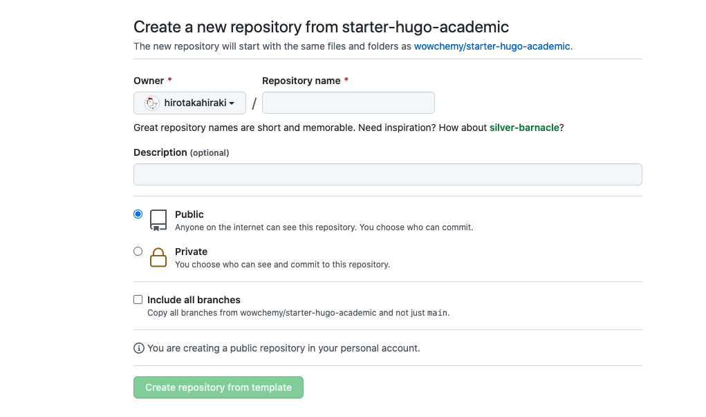

### memo: prepare for deploy academic theme in github action

1. get starter-hugo-academic from https://github.com/wowchemy/starter-hugo-academic using "Use this template" button
  

2. create public repository named with {USERNAME}.github.io
   
3. git clone this repository

4. setting baseUrl in /config/_default/config.yaml

   ```
   baseURL: 'https://{USERNAME}.github.io/' # Website URL
   ```

5. open this repository in github and setting Build and deployment github pages from settings/pages/
  
  then, set github action file in .github/workflows/
    see this commit: 